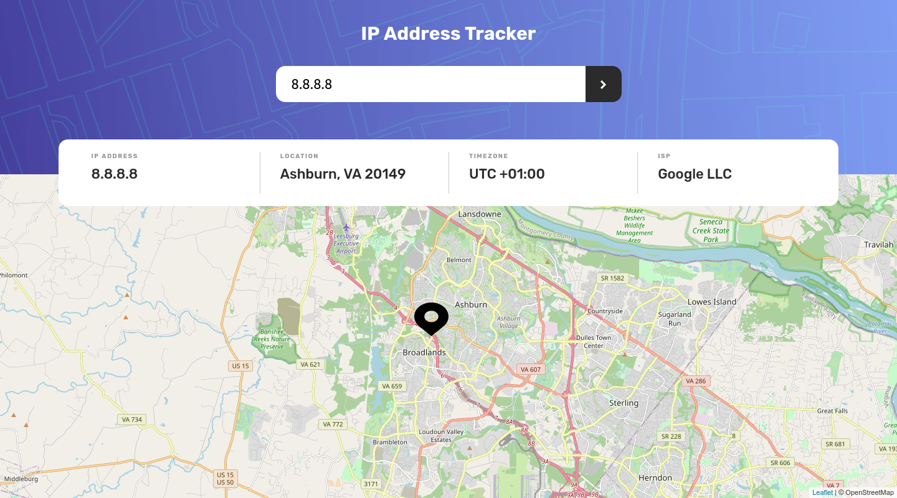
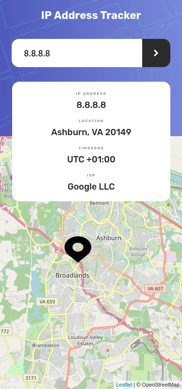

# Frontend Mentor - IP address tracker solution

This is a solution to the [IP address tracker challenge on Frontend Mentor](https://www.frontendmentor.io/challenges/ip-address-tracker-I8-0yYAH0). Frontend Mentor challenges help you improve your coding skills by building realistic projects.

## Table of contents

- [Overview](#overview)
  - [The challenge](#the-challenge)
  - [Screenshot](#screenshot)
  - [Links](#links)
  - [Built with](#built-with)
- [Author](#author)

## Overview

### The challenge

Users should be able to:

- View the optimal layout for each page depending on their device's screen size
- See hover states for all interactive elements on the page
- See their own IP address on the map on the initial page load
- Search for any IP addresses or domains and see the key information and location

### Screenshot

#### Desktop View

#### Mobile View

### Links

- Solution URL: [Add solution URL here](https://github.com/darielmedr/ip-address-tracker-angular)
- Live Site URL: [Add live site URL here](https://darielmedr.github.io/ip-address-tracker-angular)

### Built with

- Semantic HTML5 markup
- SCSS custom properties
- Flexbox
- CSS Grid
- Mobile-first workflow
- [Angular](https://angular.io/) - Angular framework
- [LeafletJS] (https://leafletjs.com/) - Open-source JavaScript library for mobile-friendly interactive maps
- [@asymmetrik/ngx-leaflet] (https://www.npmjs.com/package/@asymmetrik/ngx-leaflet) - Leaflet packages for Angular.io

## Author

- Frontend Mentor - [@darielmedr](https://www.frontendmentor.io/profile/darielmedr)
- GitHub - [@darielmedr](https://github.com/darielmedr)
- LinkedIn - [Dariel Medina Rodríguez](https://www.linkedin.com/in/darielmedr)
